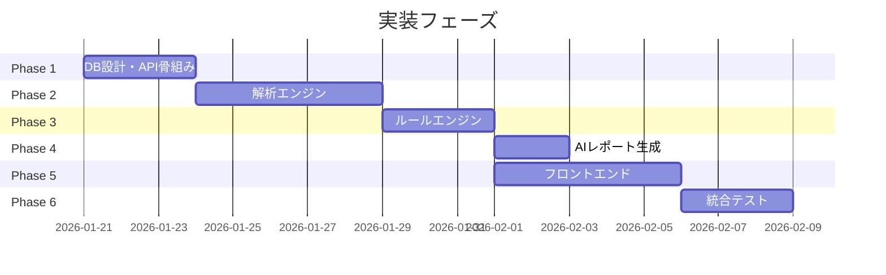

# SEO分析ツール - コーディングエージェント向け実装ガイド

Version: 1.0  
対象: コーディングエージェント（AI/人間）  
作成日: 2026-01-20

---

## 📋 目次

1. [プロジェクト概要](#1-プロジェクト概要)
2. [技術スタック](#2-技術スタック)
3. [実装フェーズ](#3-実装フェーズ)
4. [Phase 1: バックエンド基盤構築](#4-phase-1-バックエンド基盤構築)
5. [Phase 2: 解析エンジン実装](#5-phase-2-解析エンジン実装)
6. [Phase 3: ルールエンジン実装](#6-phase-3-ルールエンジン実装)
7. [Phase 4: AI レポート生成](#7-phase-4-ai-レポート生成)
8. [Phase 5: フロントエンド実装](#8-phase-5-フロントエンド実装)
9. [Phase 6: 統合テスト](#9-phase-6-統合テスト)
10. [ファイル構成](#10-ファイル構成)

---

## 1. プロジェクト概要

### 1.1 目的
SEO診断アプリケーション。自社公式HP（1URL）+ 競合（2URL）+ 紹介記事ページ（任意）を解析し、改善ToDoを優先度付きで生成する。

### 1.2 主要機能
- **URL解析**: HTML構造、メタ情報、構造化データ抽出
- **技術診断**: PageSpeed Insights連携、Core Web Vitals取得
- **検索パフォーマンス**: Google Search Console連携（オプション）
- **競合比較**: 構造差分、意図カバー差分の算出
- **ToDo生成**: ルールベースでP0/P1/P2の改善タスク生成
- **AIレポート**: `analysis_result.json`からMarkdownレポート生成

### 1.3 出力物
- `analysis_result.json`: 機械可読な解析結果
- `report.md`: AI生成の人間向けレポート

---

## 2. 技術スタック

### 2.1 バックエンド（Python）
| 用途 | 推奨ライブラリ |
|------|--------------|
| Webフレームワーク | FastAPI |
| HTML解析 | BeautifulSoup4 / lxml |
| テキスト抽出 | readability-lxml |
| PageSpeed API | requests / httpx |
| Search Console API | google-api-python-client |
| データ検証 | Pydantic v2 |
| 設定管理 | PyYAML |
| DB | PostgreSQL + asyncpg / SQLAlchemy |
| タスクキュー | Celery / RQ / Cloud Tasks |

### 2.2 フロントエンド（Next.js）
| 用途 | 推奨ライブラリ |
|------|--------------|
| フレームワーク | Next.js 14+ (App Router) |
| 言語 | TypeScript |
| スタイル | Tailwind CSS |
| UIコンポーネント | shadcn/ui (Radix) |
| アイコン | Lucide Icons |
| チャート | Recharts / Nivo |
| Markdown | react-markdown + remark-gfm |

### 2.3 データベース（PostgreSQL）
詳細は`docs/specs/spec.md` Appendix Cを参照。

---

## 3. 実装フェーズ



---

## 4. Phase 1: バックエンド基盤構築

### 4.1 プロジェクト初期化

```bash
# ディレクトリ構成
mkdir -p backend/{app,tests,config}
cd backend

# 仮想環境
python -m venv venv
source venv/bin/activate  # Windows: venv\Scripts\activate

# 依存関係インストール
pip install fastapi uvicorn pydantic pyyaml httpx beautifulsoup4 lxml asyncpg sqlalchemy
```

### 4.2 設定ファイル作成

**`config/thresholds.yml`**（`spec.md` Appendix A参照）

閾値を外部ファイル化し、運用で調整可能にする。

```yaml
app:
  schema_version: "0.1"
  max_queries_per_url: 20
  max_todos_total: 15
  max_todos_per_priority: 5
  default_locale: "ja-JP"
  default_country: "JP"
  default_device: "mobile"

technical:
  pagespeed:
    score:
      A_min: 85
      B_min: 70
      C_min: 50

content:
  official_intent_items:
    - "overview"
    - "activities"
    - "works_or_history"
    # ... 全10項目

ctr:
  opportunity:
    min_impressions_1: 300
    pos_max_1: 10
    ctr_low_ratio_to_median: 0.5
```

### 4.3 データベース設計

**テーブル一覧**（7テーブル）:
1. `sites` - プロジェクト単位
2. `pages` - 分析対象URL
3. `analysis_jobs` - 実行ジョブ
4. `analysis_job_targets` - ジョブごとの対象ページ
5. `analysis_results` - 解析結果JSON
6. `ai_reports` - AIレポートMarkdown
7. `daily_metrics` - 日次メトリクス（将来拡張）

**実装手順**:
```sql
-- docs/specs/spec.md Appendix C のSQLをそのまま実行
-- PostgreSQL 14+推奨（JSONB活用）
```

### 4.4 Pydanticモデル定義

**`app/models/schemas.py`**:

```python
from pydantic import BaseModel
from typing import List, Optional, Literal
from datetime import datetime

class PageType(str, Enum):
    OFFICIAL = "official_homepage"
    COMPETITOR = "competitor_page"
    THIRD_PARTY = "third_party_profile_page"

class PageAnalysis(BaseModel):
    page_id: str
    url: str
    page_type: PageType
    fetch: FetchResult
    html: HtmlAnalysis
    tech: TechAnalysis
    content: ContentAnalysis
    serp: SerpSnapshot
    search_console: SearchConsoleData

class AnalysisResult(BaseModel):
    schema_version: str = "0.1"
    generated_at: datetime
    run_id: str
    inputs: InputParams
    pages: List[PageAnalysis]
    comparisons: List[Comparison]
    diagnosis: Diagnosis
    todos: List[Todo]
    ai_prompt_payload: AiPromptPayload
```

### 4.5 FastAPI ルーティング

**`app/main.py`**:

```python
from fastapi import FastAPI
from app.routers import sites, pages, jobs, results

app = FastAPI(title="SEO Analysis API", version="0.1")

app.include_router(sites.router, prefix="/api/v1/sites", tags=["sites"])
app.include_router(pages.router, prefix="/api/v1/sites/{site_id}/pages", tags=["pages"])
app.include_router(jobs.router, prefix="/api/v1/sites/{site_id}/analysis-jobs", tags=["jobs"])
app.include_router(results.router, prefix="/api/v1/sites/{site_id}/analysis-results", tags=["results"])

@app.get("/api/v1/health")
async def health():
    return {"status": "ok"}
```

**エンドポイント一覧**（spec.md Appendix E参照）:

| Method | Path | 機能 |
|--------|------|------|
| POST | `/sites` | サイト作成 |
| GET | `/sites/{site_id}/pages` | URL一覧 |
| POST | `/sites/{site_id}/pages` | URL登録 |
| POST | `/sites/{site_id}/analysis-jobs` | 解析ジョブ作成 |
| GET | `/sites/{site_id}/analysis-results/{result_id}` | 結果取得 |
| GET | `/sites/{site_id}/analysis-results/{result_id}/report` | レポート取得 |

---

## 5. Phase 2: 解析エンジン実装

### 5.1 モジュール構成

```
app/
  services/
    fetcher.py           # HTTP取得 + リダイレクト追跡
    parser_html.py       # title/meta/headings/text/images/links
    parser_schema.py     # JSON-LD構造化データ抽出
    pagespeed_client.py  # PageSpeed Insights API
    gsc_client.py        # Search Console API
    intent_classifier.py # 意図カバー判定 + クエリ意図分類
```

### 5.2 fetcher.py 実装

```python
import httpx
from dataclasses import dataclass
from typing import List

@dataclass
class FetchResult:
    status_code: int
    final_url: str
    redirect_chain: List[str]
    html: str

async def http_fetch(url: str, user_agent: str = "SEOBot/1.0") -> FetchResult:
    """URLを取得し、リダイレクトチェーンも記録"""
    redirect_chain = []
    async with httpx.AsyncClient(follow_redirects=True) as client:
        response = await client.get(url, headers={"User-Agent": user_agent})
        # リダイレクト履歴を取得
        for r in response.history:
            redirect_chain.append(str(r.url))
    
    return FetchResult(
        status_code=response.status_code,
        final_url=str(response.url),
        redirect_chain=redirect_chain,
        html=response.text
    )
```

### 5.3 parser_html.py 実装

```python
from bs4 import BeautifulSoup
from dataclasses import dataclass
from typing import List, Dict

@dataclass
class HtmlAnalysis:
    title: str
    meta_description: str
    canonical: str
    robots_meta: str
    headings: Dict[str, List[str]]  # h1, h2, h3
    text_stats: Dict[str, int]       # text_length_chars, text_length_words_est
    links: Dict[str, any]            # internal_count, external_count, external_domains
    images: Dict[str, any]           # count, with_alt, alt_ratio

def parse_html(html: str, base_url: str) -> HtmlAnalysis:
    """HTML解析してSEO関連情報を抽出"""
    soup = BeautifulSoup(html, 'lxml')
    
    # title
    title_tag = soup.find('title')
    title = title_tag.get_text(strip=True) if title_tag else ""
    
    # meta description
    meta_desc = soup.find('meta', attrs={'name': 'description'})
    meta_description = meta_desc.get('content', '') if meta_desc else ""
    
    # canonical
    canonical_tag = soup.find('link', rel='canonical')
    canonical = canonical_tag.get('href', '') if canonical_tag else ""
    
    # robots meta
    robots_tag = soup.find('meta', attrs={'name': 'robots'})
    robots_meta = robots_tag.get('content', '') if robots_tag else ""
    
    # headings
    headings = {
        'h1': [h.get_text(strip=True) for h in soup.find_all('h1')],
        'h2': [h.get_text(strip=True) for h in soup.find_all('h2')],
        'h3': [h.get_text(strip=True) for h in soup.find_all('h3')]
    }
    
    # text stats
    text = soup.get_text(separator=' ', strip=True)
    text_stats = {
        'text_length_chars': len(text),
        'text_length_words_est': len(text) // 2  # 日本語は2文字≒1語
    }
    
    # links
    all_links = soup.find_all('a', href=True)
    internal_count = sum(1 for a in all_links if is_internal(a['href'], base_url))
    external_count = len(all_links) - internal_count
    
    # images
    all_images = soup.find_all('img')
    with_alt = sum(1 for img in all_images if img.get('alt'))
    
    return HtmlAnalysis(
        title=title,
        meta_description=meta_description,
        canonical=canonical,
        robots_meta=robots_meta,
        headings=headings,
        text_stats=text_stats,
        links={'internal_count': internal_count, 'external_count': external_count},
        images={'count': len(all_images), 'with_alt': with_alt, 'alt_ratio': with_alt/len(all_images) if all_images else 0}
    )
```

### 5.4 parser_schema.py 実装（構造化データ抽出）

```python
import json
from bs4 import BeautifulSoup
from typing import Dict, List

def extract_structured_data(html: str) -> Dict:
    """JSON-LD構造化データを抽出"""
    soup = BeautifulSoup(html, 'lxml')
    scripts = soup.find_all('script', type='application/ld+json')
    
    types = []
    has_faq = False
    has_organization = False
    has_article = False
    
    for script in scripts:
        try:
            data = json.loads(script.string)
            # @typeを取得（配列対応）
            if isinstance(data, list):
                for item in data:
                    t = item.get('@type', '')
                    types.append(t)
            else:
                t = data.get('@type', '')
                types.append(t)
        except json.JSONDecodeError:
            continue
    
    has_faq = 'FAQPage' in types or 'FAQ' in types
    has_organization = 'Organization' in types
    has_article = 'Article' in types or 'NewsArticle' in types
    
    return {
        'types': types,
        'has_faq_schema': has_faq,
        'has_organization_schema': has_organization,
        'has_article_schema': has_article
    }
```

### 5.5 pagespeed_client.py 実装

```python
import httpx
from typing import Optional
from dataclasses import dataclass

PAGESPEED_API_URL = "https://www.googleapis.com/pagespeedonline/v5/runPagespeed"

@dataclass
class PageSpeedResult:
    available: bool
    performance_score: Optional[int]
    lcp_ms: Optional[int]
    inp_ms: Optional[int]
    cls: Optional[float]

async def pagespeed_fetch(url: str, device: str = "mobile", api_key: str = None) -> PageSpeedResult:
    """PageSpeed Insights APIから速度データを取得"""
    params = {
        "url": url,
        "strategy": device.upper(),
        "category": "PERFORMANCE"
    }
    if api_key:
        params["key"] = api_key
    
    try:
        async with httpx.AsyncClient(timeout=30) as client:
            response = await client.get(PAGESPEED_API_URL, params=params)
            data = response.json()
        
        lighthouse = data.get("lighthouseResult", {})
        categories = lighthouse.get("categories", {})
        audits = lighthouse.get("audits", {})
        
        perf_score = categories.get("performance", {}).get("score")
        if perf_score:
            perf_score = int(perf_score * 100)
        
        lcp = audits.get("largest-contentful-paint", {}).get("numericValue")
        inp = audits.get("interaction-to-next-paint", {}).get("numericValue")
        cls = audits.get("cumulative-layout-shift", {}).get("numericValue")
        
        return PageSpeedResult(
            available=True,
            performance_score=perf_score,
            lcp_ms=int(lcp) if lcp else None,
            inp_ms=int(inp) if inp else None,
            cls=cls
        )
    except Exception:
        return PageSpeedResult(available=False, performance_score=None, lcp_ms=None, inp_ms=None, cls=None)
```

### 5.6 intent_classifier.py 実装（意図カバー判定）

```python
from typing import Dict, List

# 公式HP用の意図項目（10項目）
OFFICIAL_INTENT_ITEMS = [
    "overview",           # 何者か（概要）
    "activities",         # 活動内容
    "works_or_history",   # 公演/実績
    "media_gallery",      # 写真/メディア
    "cta_contact",        # 参加/問い合わせ導線
    "faq",                # よくある質問
    "region",             # 活動地域/所在地
    "team_or_operator",   # メンバー/運営情報
    "freshness",          # 最新情報/更新性
    "audience_branch"     # 観客/参加希望の導線分岐
]

# 紹介記事用の意図項目（6項目）
THIRD_PARTY_INTENT_ITEMS = [
    "brand_clear",        # 自社名が明確
    "description_depth",  # 説明文十分
    "unique_points",      # 特徴・差別化
    "region_or_genre",    # 地域/ジャンル
    "official_link",      # 公式HPリンク
    "cta_present"         # 参加/予約導線
]

def compute_intent_coverage(
    page_type: str,
    title: str,
    h2_list: List[str],
    text: str,
    links: Dict,
    brand_terms: List[str]
) -> Dict:
    """ページタイプに応じた意図カバー率を計算"""
    
    if page_type == "official_homepage":
        items = OFFICIAL_INTENT_ITEMS
        coverage = check_official_intent(title, h2_list, text, links)
    else:
        items = THIRD_PARTY_INTENT_ITEMS
        coverage = check_third_party_intent(title, h2_list, text, links, brand_terms)
    
    missing = [item for item in items if coverage.get(item, 0) == 0]
    
    return {
        "intent_coverage": coverage,
        "missing_sections": missing,
        "notes": []
    }

def check_official_intent(title: str, h2_list: List[str], text: str, links: Dict) -> Dict:
    """公式HP用の意図カバーチェック"""
    coverage = {}
    
    # キーワードベースで簡易判定
    h2_text = " ".join(h2_list).lower()
    text_lower = text.lower()
    
    coverage["overview"] = 1 if any(k in h2_text for k in ["概要", "について", "とは"]) else 0
    coverage["activities"] = 1 if any(k in h2_text for k in ["活動", "事業", "サービス"]) else 0
    coverage["works_or_history"] = 1 if any(k in h2_text for k in ["実績", "公演", "作品", "履歴"]) else 0
    coverage["media_gallery"] = 1 if any(k in h2_text for k in ["写真", "ギャラリー", "動画", "メディア"]) else 0
    coverage["cta_contact"] = 1 if any(k in text_lower for k in ["お問い合わせ", "参加", "申込", "予約"]) else 0
    coverage["faq"] = 1 if any(k in h2_text for k in ["faq", "質問", "q&a"]) else 0
    coverage["region"] = 1 if any(k in text_lower for k in ["東京", "大阪", "所在地", "住所"]) else 0
    coverage["team_or_operator"] = 1 if any(k in h2_text for k in ["メンバー", "運営", "代表", "チーム"]) else 0
    coverage["freshness"] = 1 if any(k in h2_text for k in ["最新", "ニュース", "お知らせ", "2024", "2025", "2026"]) else 0
    coverage["audience_branch"] = 1 if any(k in text_lower for k in ["観客", "参加希望", "初めての方"]) else 0
    
    return coverage
```

---

## 6. Phase 3: ルールエンジン実装

### 6.1 モジュール構成

```
app/
  services/
    rule_engine.py       # スコアリング + 原因推定 + ToDo生成
    comparator.py        # 競合比較（diff計算）
```

### 6.2 スコアリングルール

**Technical Score（A/B/C/D）**:
```python
def compute_technical_score(pagespeed_score: int, robots_meta: str, status_code: int, mobile_hint: str) -> str:
    # D: 致命的問題
    if status_code != 200 or "noindex" in robots_meta:
        return "D"
    if pagespeed_score and pagespeed_score < 50:
        return "D"
    
    # C: 要改善
    if pagespeed_score and 50 <= pagespeed_score < 70:
        return "C"
    if mobile_hint == "fail":
        return "C"
    
    # B: 良好
    if pagespeed_score and 70 <= pagespeed_score < 85:
        return "B"
    
    # A: 優秀
    return "A"
```

**Content Score（公式HP）**:
- 10項目中のカバー数で判定
- A: 9-10, B: 7-8, C: 5-6, D: 0-4

**CTR Score（Search Consoleあり時のみ）**:
- チャンス比率で判定
- A: <10%, B: 10-20%, C: 20-35%, D: >35%

### 6.3 原因推定（main_cause）

```python
def compute_main_cause(scores: Dict, comparisons: List) -> Dict:
    """原因をcontent_quality/ctr/technical/mixedで推定"""
    breakdown = {"content_quality": 0, "ctr": 0, "technical": 0}
    
    # Technical優先
    if scores["technical"] in ["C", "D"]:
        breakdown["technical"] = 50
    
    # Content次点
    if scores["content"] in ["C", "D"]:
        breakdown["content_quality"] = 40
    
    # CTR
    if scores.get("ctr") in ["C", "D"]:
        breakdown["ctr"] = 30
    
    # 正規化
    total = sum(breakdown.values()) or 1
    breakdown = {k: int(v / total * 100) for k, v in breakdown.items()}
    
    # main_cause決定
    max_key = max(breakdown, key=breakdown.get)
    if breakdown[max_key] < 45:
        main_cause = "mixed"
    else:
        main_cause = max_key
    
    return {"main_cause": main_cause, "breakdown": breakdown}
```

### 6.4 ToDo生成ルール

```python
def generate_todos(pages, comparisons, diagnosis, cfg) -> List[Dict]:
    """P0/P1/P2のToDoを最大15件生成"""
    todos = []
    
    official = find_page(pages, "official_homepage")
    
    # P0: 今すぐ（致命的）
    if official["fetch"]["status_code"] != 200:
        todos.append(create_todo("P0", "technical", "HTTPステータスコードが200でない", "indexing_critical"))
    
    if "noindex" in official["html"]["robots_meta"]:
        todos.append(create_todo("P0", "technical", "noindexが設定されている", "indexing_critical"))
    
    if not official["content"]["intent_coverage"].get("cta_contact"):
        todos.append(create_todo("P0", "content", "問い合わせ/参加導線（CTA）が不足", "core_sections_missing"))
    
    # P1: 1-2週間
    if not official["html"]["structured_data"].get("has_faq_schema"):
        todos.append(create_todo("P1", "content", "FAQセクションと構造化データの追加", "faq_addition"))
    
    # P2: 継続
    todos.append(create_todo("P2", "content", "コンテンツクラスター化の検討", "content_cluster"))
    
    # 上限適用
    return enforce_limits(todos, max_total=15, max_per_priority=5)
```

---

## 7. Phase 4: AI レポート生成

### 7.1 プロンプトテンプレート

```python
PROMPT_TEMPLATE = """
あなたはSEOコンサルタントです。以下の入力データ（JSON）に基づき、Markdown形式の「SEO診断レポート」を作成してください。

【厳守ルール】
- 推測しない。根拠がない断定は禁止。根拠がない場合は「可能性」「要確認」と書く。
- すべての重要な指摘には、必ず入力JSON内の evidence を引用して根拠を示す。
- 出力は指定のMarkdown見出し構造を必ず守る。
- ToDoは P0/P1/P2 に分け、各ToDoに「手順」「具体案」「根拠」「検証指標」を含める。

【出力構造（必須）】
# SEO診断レポート
## 対象URL
## 結論（最優先3点）
## 原因推定（なぜ伸びないか・差があるか）
## 公式ホームページ 改善ToDo（P0/P1/P2）
## 紹介記事ページ 改善依頼（依頼テンプレ付き）
## 競合との差分（構造・訴求・テクニカル）
## 検証計画（7日 / 28日）

【入力JSON】
{AI_PROMPT_PAYLOAD_JSON}
"""
```

### 7.2 ai_reporter.py 実装

```python
import openai  # or anthropic

async def generate_report_md(ai_payload: Dict, cfg: Dict) -> str:
    """LLMを呼び出してレポートMarkdownを生成"""
    prompt = PROMPT_TEMPLATE.replace("{AI_PROMPT_PAYLOAD_JSON}", json.dumps(ai_payload, ensure_ascii=False, indent=2))
    
    response = await openai.ChatCompletion.acreate(
        model="gpt-4o",
        messages=[{"role": "user", "content": prompt}],
        temperature=0.3
    )
    
    md = response.choices[0].message.content
    
    # 見出し構造の検証
    if not validate_report_markdown(md):
        md = await repair_report(ai_payload, md)
    
    return md

def validate_report_markdown(md: str) -> bool:
    """必須見出しが含まれているかチェック"""
    required = [
        "# SEO診断レポート",
        "## 対象URL",
        "## 結論",
        "## 原因推定",
        "## 公式ホームページ",
        "## 競合との差分",
        "## 検証計画"
    ]
    return all(h in md for h in required)
```

---

## 8. Phase 5: フロントエンド実装

### 8.1 プロジェクト初期化

```bash
npx -y create-next-app@latest frontend --typescript --tailwind --eslint --app --src-dir
cd frontend

# shadcn/ui セットアップ
npx -y shadcn@latest init

# 必要なコンポーネント追加
npx shadcn add button card badge tabs dialog input
```

### 8.2 テーマ設定（Midnight Neon）

**`styles/globals.css`**（spec.md Appendix H参照）:
- ダークテーマ: `#0f1729`ベース
- アクセント: シアン `#35D4FF` + バイオレット `#A78BFA`
- グラスモーフィズム効果

### 8.3 ページ構成

| パス | 機能 |
|------|------|
| `/` | ダッシュボード |
| `/sites/[siteId]/pages` | URL管理 |
| `/sites/[siteId]/run` | 実行設定 |
| `/sites/[siteId]/results` | 結果一覧 |
| `/sites/[siteId]/results/[resultId]` | 結果詳細 |

### 8.4 主要コンポーネント

**レイアウト**:
- `TopNav` - グローバルナビ
- `SideRail` - サイト内ナビ（アイコンのみ）
- `GlassCard` - グラスモーフィズムカード

**ページ管理**:
- `PageTypeTabs` - 公式/競合/紹介記事のタブ
- `PagesTable` - URL一覧テーブル
- `UrlAddModal` - URL追加モーダル
- `SelectionTray` - 選択済みURL表示

**実行**:
- `RunConfigCard` - 設定カード
- `RunButton` - 実行ボタン
- `JobStatusBanner` - ジョブ進捗表示

**結果**:
- `ResultHeader` - ヘッダー（スコアバッジ付き）
- `TodoBoard` - P0/P1/P2カラム表示
- `CompetitorDiffPanel` - 競合差分表示
- `ReportMarkdown` - AIレポート表示

### 8.5 API クライアント

**`lib/api/queries.ts`**（spec.md Appendix G参照）:

```typescript
export async function createAnalysisJob(siteId: UUID, input: JobInput) {
  return apiFetch(routes.jobs(siteId), { method: "POST", body: input });
}

export async function getResult(siteId: UUID, resultId: UUID) {
  return apiFetch(routes.result(siteId, resultId));
}
```

---

## 9. Phase 6: 統合テスト

### 9.1 テストケース

1. **URL登録 → 解析実行 → 結果取得** のE2Eフロー
2. **公式HP 1 + 競合 2** の最小構成での動作確認
3. **PageSpeed API** のタイムアウト/エラーハンドリング
4. **AIレポート** の見出し構造検証
5. **フロントエンド** の各画面表示確認

### 9.2 受け入れ基準（MVP）

- [ ] `analysis_result.json` がスキーマに準拠
- [ ] 公式HPで title/meta/h2一覧/missing_sections が埋まる
- [ ] 競合2URLで title/meta/h2一覧/FAQ schema有無 が埋まる
- [ ] `comparisons` が2件生成される
- [ ] `diagnosis.main_cause` がルールで算出される
- [ ] `todos` が最大15件、P0/P1/P2で割り振られる
- [ ] `report.md` が指定の見出し構造を満たす

---

## 10. ファイル構成

```
SEO分析/
├── docs/
│   └── specs/
│       ├── spec.md                # 詳細仕様書（262KB）
│       └── analysis_checklist.md  # 分析チェックリスト
│
├── backend/
│   ├── app/
│   │   ├── main.py                # FastAPIエントリポイント
│   │   ├── models/
│   │   │   └── schemas.py         # Pydanticモデル
│   │   ├── routers/
│   │   │   ├── sites.py
│   │   │   ├── pages.py
│   │   │   ├── jobs.py
│   │   │   └── results.py
│   │   └── services/
│   │       ├── fetcher.py
│   │       ├── parser_html.py
│   │       ├── parser_schema.py
│   │       ├── pagespeed_client.py
│   │       ├── gsc_client.py
│   │       ├── intent_classifier.py
│   │       ├── comparator.py
│   │       ├── rule_engine.py
│   │       ├── ai_reporter.py
│   │       └── storage.py
│   ├── config/
│   │   └── thresholds.yml
│   ├── tests/
│   └── requirements.txt
│
├── frontend/
│   ├── app/
│   │   ├── layout.tsx
│   │   ├── page.tsx               # Dashboard
│   │   └── sites/[siteId]/
│   │       ├── pages/page.tsx
│   │       ├── run/page.tsx
│   │       └── results/
│   │           ├── page.tsx
│   │           └── [resultId]/page.tsx
│   ├── components/
│   │   ├── layout/
│   │   ├── pages/
│   │   ├── run/
│   │   └── results/
│   ├── lib/
│   │   └── api/
│   │       ├── client.ts
│   │       ├── routes.ts
│   │       ├── types.ts
│   │       └── queries.ts
│   └── styles/
│       └── globals.css
│
└── docker-compose.yml             # PostgreSQL + Backend + Frontend
```

---

## 📌 クイックリファレンス

### 重要なスキーマ参照
- **JSON Schema**: `spec.md` セクション2
- **DBスキーマ**: `spec.md` Appendix C
- **APIルート**: `spec.md` Appendix E
- **閾値設定**: `spec.md` Appendix A

### 判定ルール参照
- **スコアリング**: `spec.md` セクション3.2
- **原因推定**: `spec.md` セクション3.3
- **ToDo生成**: `spec.md` セクション3.4

### UI参照
- **コンポーネント仕様**: `spec.md` Appendix F
- **画面ワイヤーフレーム**: `spec.md` Appendix G
- **テーマ設定**: `spec.md` Appendix H

---

> このガイドは `docs/specs/spec.md` と `docs/specs/analysis_checklist.md` を基に作成されています。  
> 詳細な仕様は元ファイルを参照してください。
